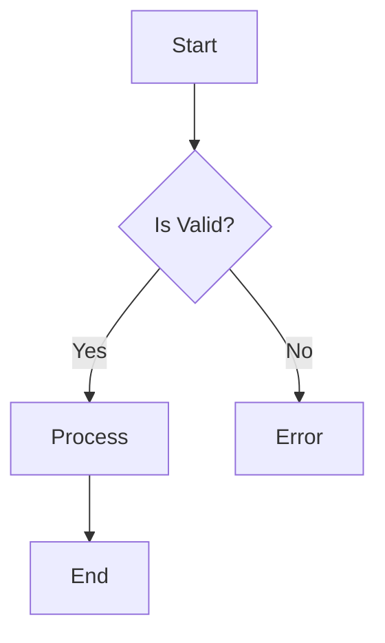
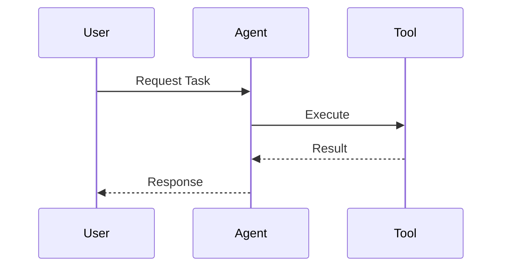

# Visualization: Mermaid Graphs

## 🎯 Purpose
Leverage Claude 3.7's native rendering capabilities to visualize complex systems, flows, and architectures.

## 🛠️ Usage
Request the model to "Visualize X using Mermaid".

### Examples

**Flowchart**:

**Sequence Diagram**:

## 💡 Best Practices
- Keep diagrams simple for faster rendering.
- Use `graph TD` for hierarchical structures.
- Use `sequenceDiagram` for interactions.
