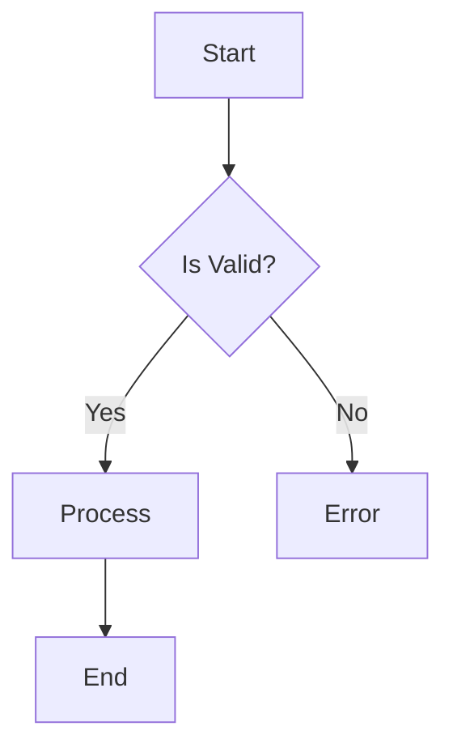
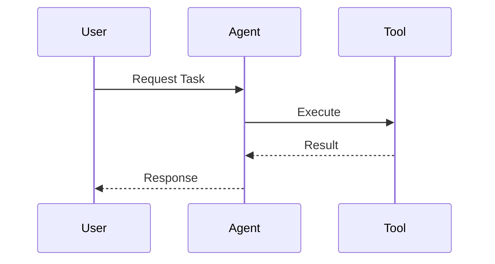

# Visualization: Mermaid Graphs

## 🎯 Purpose
Leverage Claude 3.7's native rendering capabilities to visualize complex systems, flows, and architectures.

**New in 2026-W06**: Claude 3.7 now natively supports rendering Mermaid graphs in chat interfaces, making architectural and data flow diagrams much more accessible and interactive for users without external plugins.

## 🛠️ Usage
Request the model to "Visualize X using Mermaid".

### Examples

**Flowchart**:

```mermaid
graph TD;
    A[Start] --> B{Is Valid?};
    B -- Yes --> C[Process];
    B -- No --> D[Error];
    C --> E[End];
```

**Sequence Diagram**:

```mermaid
sequenceDiagram
    User->>Agent: Request Task
    Agent->>Tool: Execute
    Tool-->>Agent: Result
    Agent-->>User: Response
```

## 💡 Best Practices
- Keep diagrams simple for faster rendering.
- Use `graph TD` for hierarchical structures.
- Use `sequenceDiagram` for interactions.
